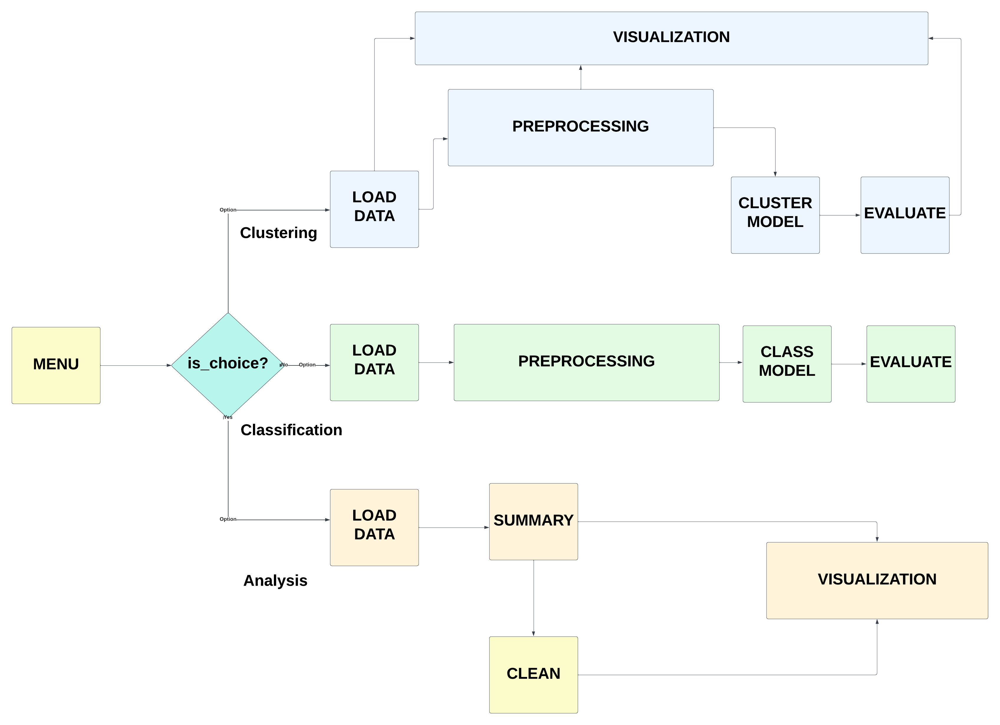

# Multivariant time series clustering

## General Description of the project

In this project, we tried to implement a pipeline to cluster multivariant time series data of human movements detected by sensors worn behind the neck (\_n) and on a belt (\_r). The accelerometer and gyroscope integrated into the device provide insights on movements in the x,y,z plains.

## Pipeline of the project

The effectiveness of the methods used in the pipeline was that they are enabling the use of different features and preprocessing steps on the data provided by the client.
These methods are first tried on the labeled data provided by the client. And they were then further used on unlabelled movement data in attempts to cluster unlabeled data into distinct movements.

Our pipeline works in a more modular manner, to give freedom to the user to choose the features they would like to examine, preprocessing steps that the
data has to go through, and the model for clustering. Given the size, and variety of the data inputs, we found that this modularity was key for better and more distinctive clustering. The file modeling/main.py contains the pipeline.

We also take the scope of the project higher, so that it can classify the labeled data. A module for analyzing and visualizing the data is also integrated also proposed in this pipeline.



#### Data Preprocessing libraries used:

major libraries:

| preprocessing            | library    |
| ------------------------ | ---------- |
| Haar filter              | PyWavelets |
| symbolic aggregation(SAX | tslearn    |
| PCA                      | sklearn    |

#### Clustering Methods:

- K_means

- DBSCAN

## Deployment

The application is deployed with streamlit locally.

1. Install virtualenv

```bash
pip install virtualenv
```

2. Create a virtual environment and activate it

```bash
virtualenv venv
> On windows -> venv\Scripts\activate
> On Linux -> . env/bin/activate

```

3. Install the necessary libraries

```bash
pip install -r requirements.txt

```

4. Run app.py

```bash
streamlit run deployment/app.py

```


## Contributors:

- [Amanuel Zeredawit: Junior ML Engineer at Becode](https://github.com/AmanuelZeredawit)
- [Maysa AbuSharekh: Junior ML Engineer at Becode](https://github.com/maysahassan)
- [Samuel Fooks: Junior ML Engineer at Becode](https://github.com/samuelfooks)
- [Shakil: Junior Data Analyst](https://github.com/shakilkhan8219)

## Acknowledgments

- BeCode Arai4 AI coaches(Chrysanthi and Louis)

© 2023 Becode, Ghent.

