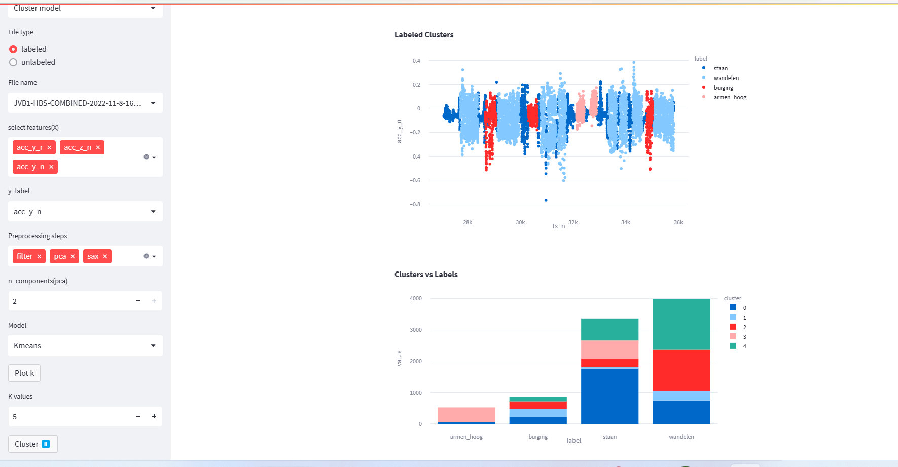

# ML_Project (SPINEWISE)

## General Description of the project
In this project, we tried to implement a pipeline to cluster multivariant time series data of human movements detected by sensors worn behind the neck (_n) and on a belt (_r). The accelerometer and gyroscope integrated into the device provide insights on movements in the x,y,z plains.


## Pipeline of the project

The pipeline uses a few different methods to filter the input data from an accelerometer, gyroscope, magnetometer, and calculation device.  


The effectiveness of the methods used in the pipeline was that they are enabling the use of different features and preprocessing steps on the data provided by the client. 
These methods are first tried on the labeled data provided by the client. And they were then further used on unlabelled movement data in attempts to cluster unlabeled data into distinct movements.  

Our pipeline works in a more modular manner, to give freedom to the user to choose the features they would like to examine, preprocessing filters
they find give the most clarity in the data before clustering, and the option to use our clustering methods or insert other clustering methods in 
our clustering file. Given the size, and variety of the data inputs, we found that this modularity was key for better and more distinctive clustering.
Function modeling/main.py contains the pipeline.  It takes in input from the user as well as a '.csv' file, the input from the user determines which features, filtering, and clustering to be used.

we also take the scope of the project higher, so that it can classify the labeled data. A module for Analysing and visualizing the data is also integrated into
our solution.


#### Data Preprocessing libraries used:

* Hillbert Filter from sklearn

* Haar filter from Pytw

* Symbolic Aggregession(SAX) from Tslearn

* Principal Component Analysis(PCA) from sklearn

#### Clustering Methods:

* K_means

* DBSCAN

## Deployment 
The application is deployed with streamlet locally. 


1. Install virtualenv

```bash
pip install virtualenv
```
2. Create a virtual environment and activate it
```bash
virtualenv venv
> On windows -> venv\Scripts\activate
> On Linux -> . env/bin/activate

```
3. Install the necessary libraries
```bash
pip install -r requirements.txt

```


## Github link:

[github link](https://github.com/SpineWiseTeam4/ML_Project)

## Contributors:

* [Amanuel Zeredawit: junior ML engineer at Becode](https://github.com/AmanuelZeredawit)
* [Maysa AbuSharekh: junior ML engineer at Becode](https://github.com/maysahassan)
* [Sam Fooks: junior ML engineer at Becode](https://github.com/samuelfooks)


## Acknowledgments
BeCode Arai4 AI coaches(Chrysanthi and Louis)
SpineWise developing teams

© 2022 Becode, Ghent.


	

